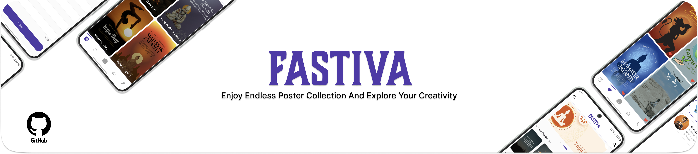
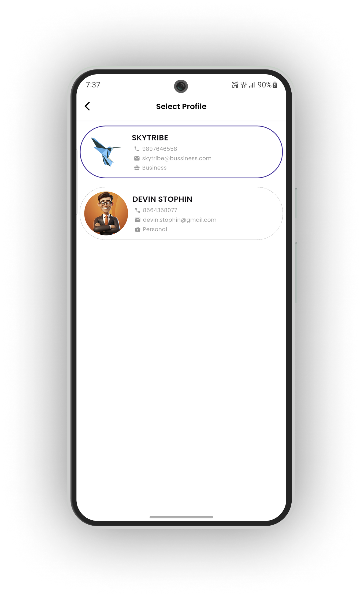
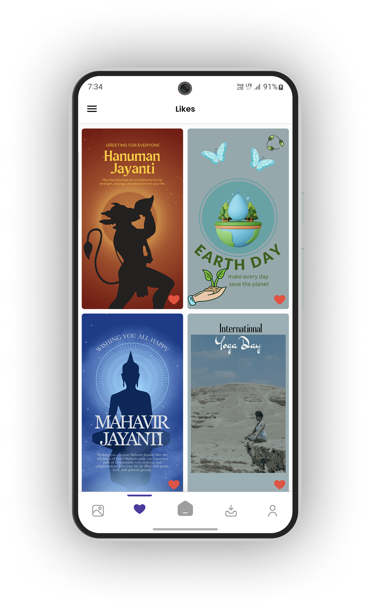
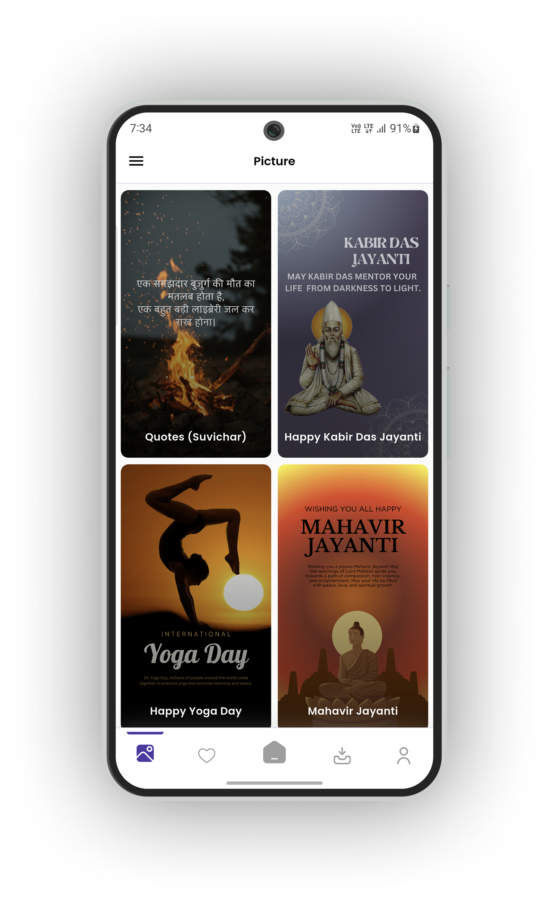
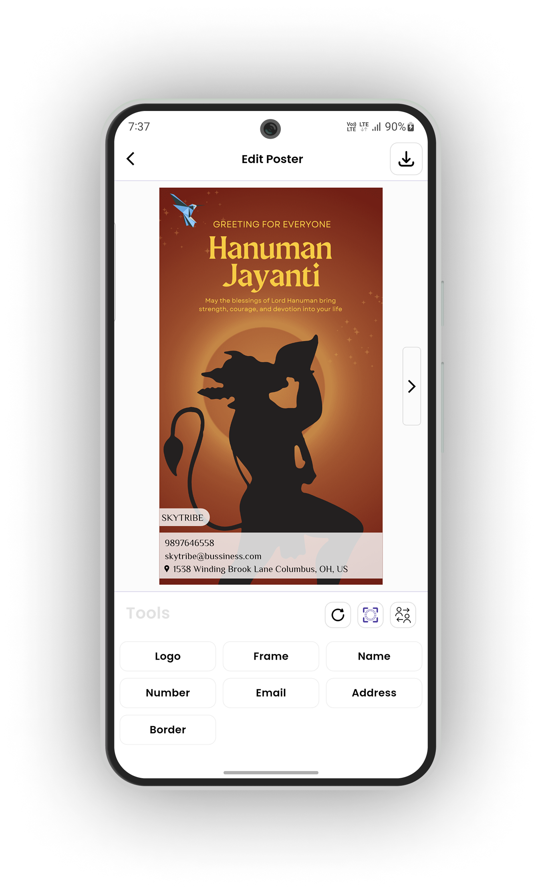
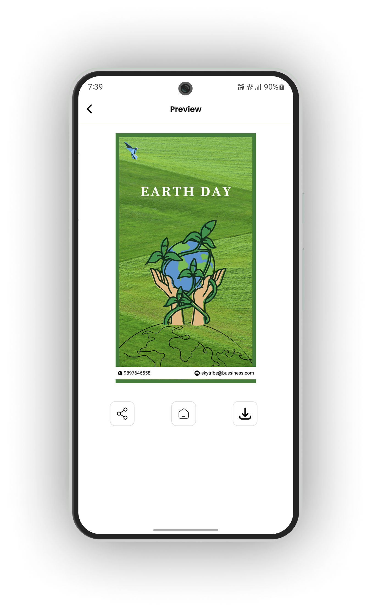
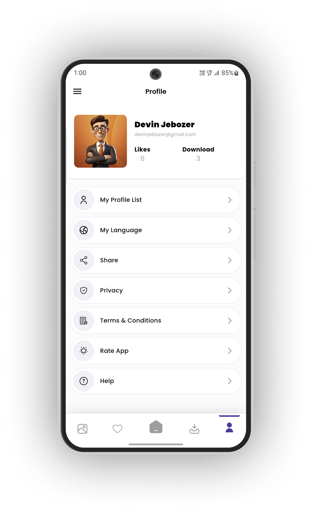
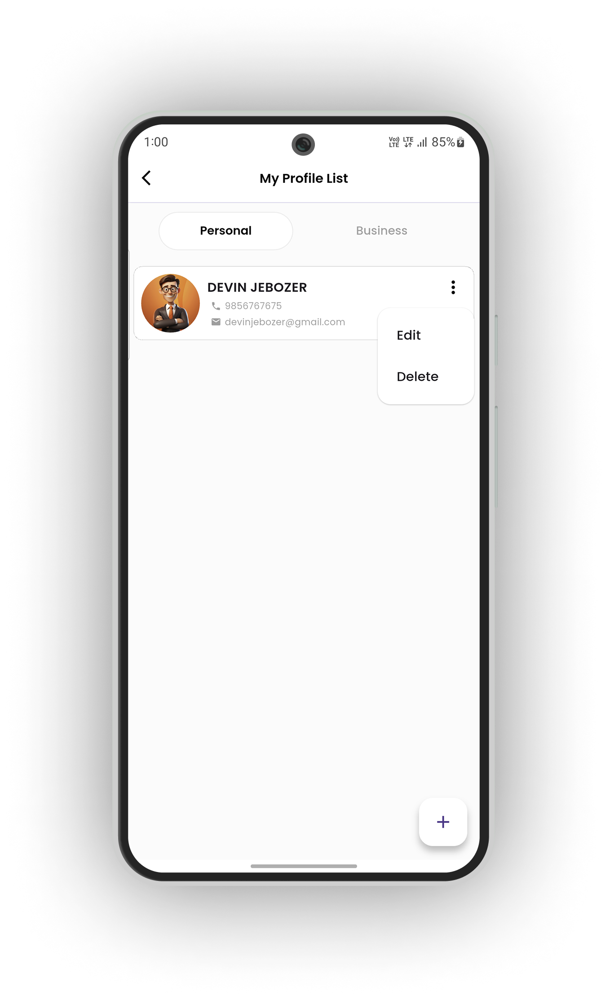
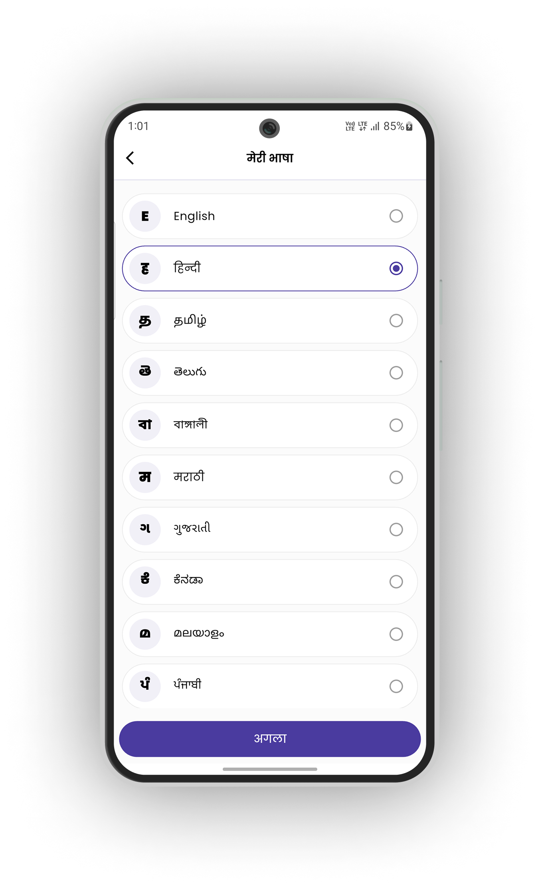

# 🚀 Fastiva – Poster Maker & Business Branding Tool

**Fastiva** is a powerful Flutter app crafted to help Indian businesses and individuals create personalized, beautiful festival posters. Whether it’s Diwali, Holi, Independence Day, or any other Indian celebration, Fastiva lets you add your logo, name, and business info to vibrant designs and share them anywhere — in just a few taps.




## 🪔 About Fastiva

Fastiva makes it easy for Indian users to:

- Create festival posters with **your name, logo, and business info**
- Choose from a huge **collection of templates**
- Customize colors, text position, and frames
- Use the app in **your native Indian language**
- Save or share in **one tap**
- Maintain separate **business & personal profiles**

**And the best part?** Your data stays on your device — we don’t collect anything.

---

## 📱 Screenshots

Explore the Fastiva app through these visual flows:

---

### 1️⃣ Profile Setup & Management

| Add Profile | Manage Profile |
|-------------|----------------|
|  |  |

> Start by creating your business or personal profile. Easily manage and switch between multiple profiles.


### 2️⃣ Poster Selection, Editing & Download Flow

| Home Collection | Liked Posters | Categories  |
|-----------------|-------------|-------------|
|  |  |  |

| Edit Poster| Poster Preview & Download |
|------------|----------------------------|
|  |  |

> Choose a festival category, customize your poster with your brand, and download or share it instantly.


### 3️⃣ Active Profile View & Language Settings

| Active Profile | Edit Profile | Language Selector |
|----------------|--------------|-------------------|
|  |  |  |

> View or switch your active profile and change your preferred language anytime. Fastiva supports 12 Indian languages.

---

[](https://www.buymeacoffee.com/sanketkalae)

---

## ✨ Features

- 🎨 Huge library of Indian festival posters  
- 🖼️ Upload and crop your business logo  
- 🧾 Personalize with name, address, and contact  
- 🌈 Change poster colors, frame style, and text position  
- 🗃️ Like templates to save for later  
- 🔄 Download history with re-download option  
- 🔍 Search posters by festival or keyword  
- 🌐 Multi-language support (Hindi, Marathi, Gujarati & more)  
- 🕓 No-time customization: Like now, edit later  
- 🔐 All data stored **locally**, not on servers  
- 📲 Works **offline** after first-time setup  
- 👥 Switch between **business** and **personal** profiles  

---

## 🧭 App Flow

1. **Set Profile**  
   Add your name, logo, mobile, and address once — it’s all stored securely on your device.

2. **Explore Posters**  
   Scroll through curated Indian festival templates with search and category filters.

3. **Customize**  
   Personalize the posters with your details. Adjust positioning, colors, and styles.

4. **Download or Share**  
   Instantly save to gallery or share via WhatsApp, Instagram, or other platforms.

---

## 🌐 Supported Languages

Fastiva supports multiple Indian languages so everyone can use the app in their own native language:

- 🇬🇧 English  
- 🇮🇳 Hindi  
- 🇮🇳 Gujarati  
- 🇮🇳 Marathi  
- 🇮🇳 Panjabi  
- 🇵🇰 Urdu  
- 🇮🇳 Telugu  
- 🇮🇳 Tamil  
- 🇮🇳 Kannada  
- 🇮🇳 Malayalam  
- 🇮🇳 Bengali  
- 🇮🇳 Odia

> More regional languages will be added in future updates!

---

## 🧩 Flutter Packages Used

### 🎨 UI & Styling
- `google_fonts`  
- `flutter_svg`  
- `lottie`  
- `shimmer`  
- `flutter_colorpicker`  
- `dotted_border`  
- `flutter_staggered_grid_view`  
- `carousel_slider`  
- `sizer`  
- `cupertino_icons`  

### 🖼️ Image & Media Handling
- `image_picker`  
- `image_cropper`  
- `image`  
- `cached_network_image`  
- `gal`  
- `share_plus`  

### 🧠 State Management & Utilities
- `get`  
- `dartz`  

### 📝 Forms & Input
- `form_field_validator`  
- `fluttertoast`  
- `intl`  

### 🔗 Networking & Backend
- `dio`  
- `encrypt`  
- `connectivity_wrapper`  

### 💾 Storage & Permissions
- `shared_preferences`  
- `path_provider`  
- `permission_handler`  

### 🔁 UX Enhancements
- `pull_to_refresh`  
- `url_launcher`  

---

## ⚙️ Installation

```bash
# Clone the repository
git clone https://github.com/your-username/fastiva.git
cd fastiva

# Install dependencies

flutter pub get

# Run the app
flutter run
```
---

## 🔒 Privacy & Data Policy

- ✅ **No data stored on our servers**  
- 🔒 **All profile data is stored securely on your device**  
- 🚫 **No tracking, no ads**  
- 📴 **Works completely offline after setup**

---

## 📜 License & Attribution

© 2025 Sanket Kalathiya — All rights reserved.  
This project is licensed under the **MIT License**.

> If you reuse or distribute this code in any form, you **must credit Sanket Kalathiya** clearly in the documentation or app UI.

